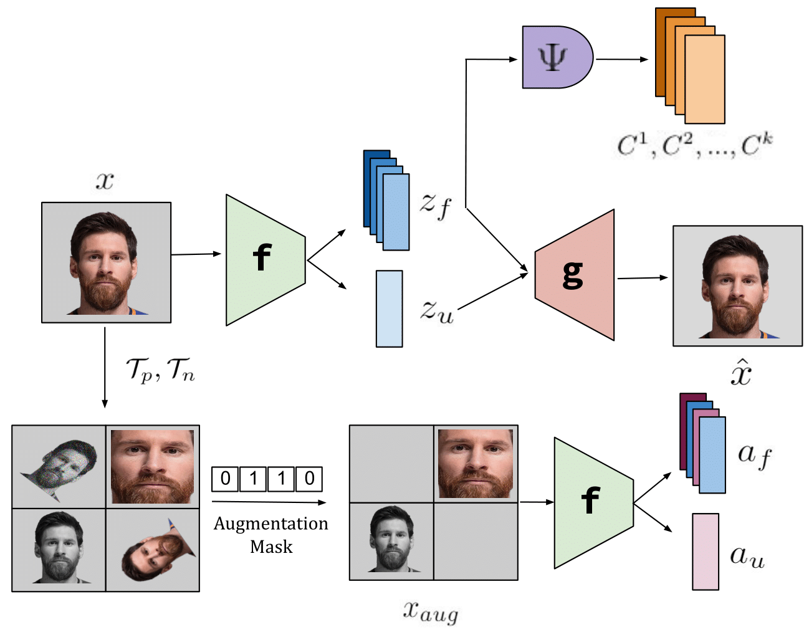

# DisCont: Self-Supervised Visual Attribute Disentanglement using Context Vectors

This repository contains code for the paper <a href="">DisCont: Self-Supervised Visual Attribute Disentanglement using Context Vectors</a>.

## Abstract
Disentangling the underlying feature attributes within an image with no prior supervision is a challenging task. Models that can disentangle attributes well provide greater interpretability and control. In this paper, we propose a self-supervised framework \textit{DisCont} to disentangle multiple attributes by exploiting the structural inductive biases within images. Motivated by the recent surge in contrastive learning paradigms, our model bridges the gap between self-supervised contrastive learning algorithms and unsupervised disentanglement. We evaluate the efficacy of our approach, both qualitatively and quantitatively, on four benchmark datasets.



In case you find any of this useful, consider citing:
```
bibtex
```

## Installing Dependencies
For installing the required libraries, run the following command.
```
pip install -r requirements.txt
```

## Training

In order to begin training, run the following command.

```
python train.py
```

## Evaluation

For evaluation of the trained model using feature swapping, run the following command.
```
python style_transfer.py
```

In order to plot the latent space visualizations, run the following command.
```
python latent_visualization.py
```
